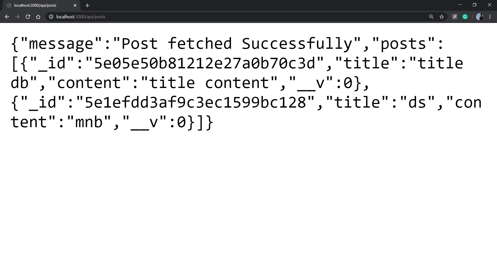
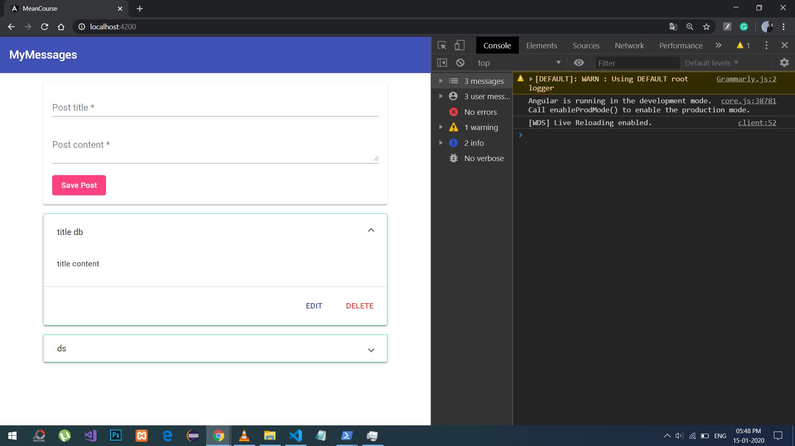
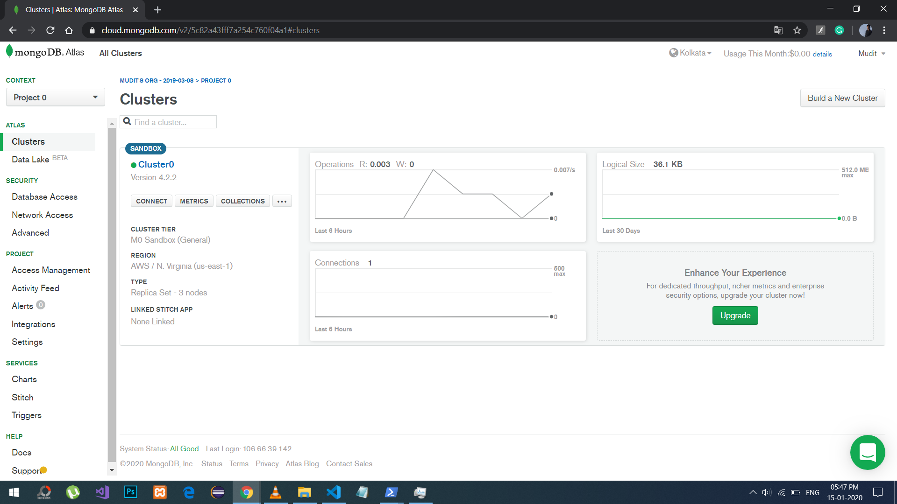

# MeanCourse

This project was generated with [Angular CLI](https://github.com/angular/angular-cli) version 8.3.20.

## Development server

Run `ng serve` for a dev server. Navigate to `http://localhost:4200/`. The app will automatically reload if you change any of the source files.

Run `npm run start:server` for a nodemon server using [server.js](server.js). Navigate to `http://localhost:4200/`. The app will automatically reload if you change any of the source files.

#### Node server (localhost:3000/api/posts)

#### Angular frontend (localhost:4200)

#### MongoDB Atlas Cloud Cluster
